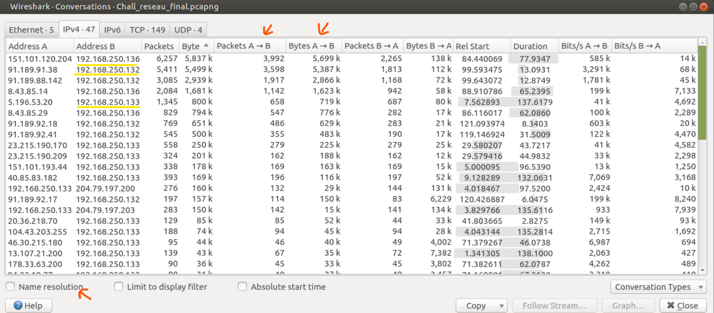
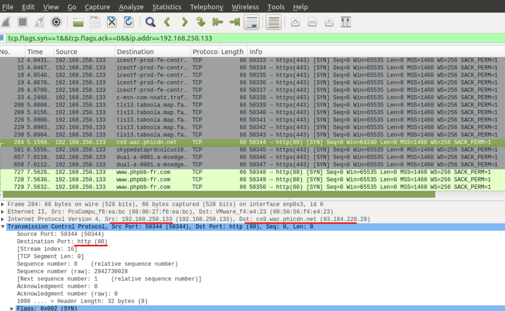
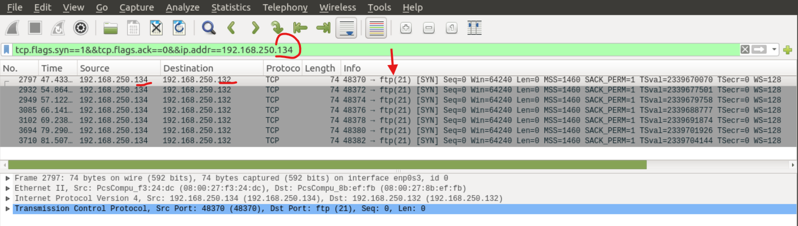
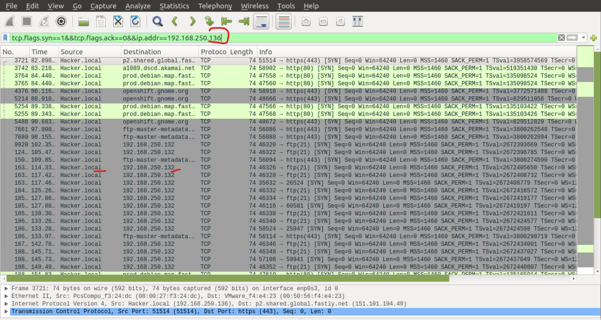
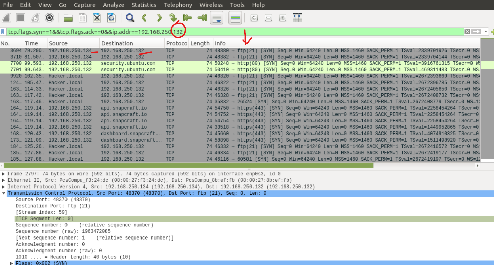
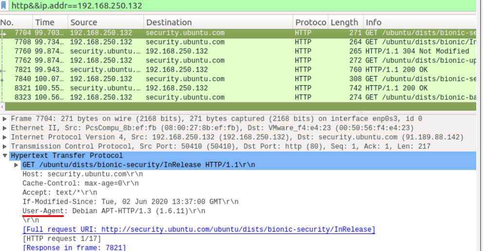
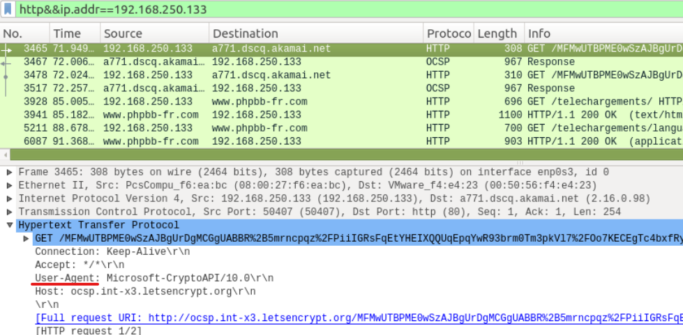

# Cartographie du réseau

## Objectif
Identifier les hôtes actifs, leurs rôles et les principales communications observées au sein du réseau local.

## I. Analyse des communications réseau

### Objectif
Identifier les machines les plus actives et comprendre les relations de communication entre les hôtes internes et les services externes.

### Méthode
Analyse réalisée à l’aide de Wireshark via l’outil : "Statistiques → Conversations".

Cette fonctionnalité permet d'identifier :
- les hôtes actifs,
- les volumes de trafic échangés,
- les communications internes et externes,
- ainsi que les relations entre machines.

### Résultats

Quatre adresses IP privées ont été identifiées :
- 192.168.250.132
- 192.168.250.133
- 192.168.250.134
- 192.168.250.136

Le réseau analysé est un réseau local (LAN) utilisant un plan d’adressage privé de type : 192.168.250.x/24.

Distinction des communications :

| Type d’adresse                 | Signification                 |
| ------------------------------ | ----------------------------- |
| IP privées                     | Communications internes (LAN) |
| IP publiques / noms de domaine | Communications vers Internet  |

L’analyse des flux mmet en évidence plkusieurs échanges significatifs entre les machines locales et des serveus externes et aussi entre machines locales.

Les principales communications observées sont présentées ci-dessous.

    1)  A: 151.101.120.204 (prod.debian.map.fastly.net) 
        B: 192.168.250.136 (Hacker.local)
    
        Flux   |    A>B    |    B>A    |  Total   |
    -----------|-----------|-----------|----------|
    en packets |  3992     |   2265    |  6257    |
    en bytes   |  5699k    |   138k    |  5837k   | 
    en bits/s  |  585k     |    14k    |          |
    

    2)  A: 91.189.91.38 (security.ubuntu.com) 
        B: 192.168.250.132 

        Flux   |    A>B    |    B>A    |  Total |
    -----------|-----------|-----------|--------|
    en packets |   3598    |    1813   |  5411  |
    en bytes   |   5387k   |    112k   | 5499k  |
    en bits/s  |   3291k   |    68k    |        |

    3)  A: 91.189.88.142 (security.ubuntu.com)
        B: 192.168.250.132 
    
        Flux   |    A>B    |    B>A    |    Total |
    -----------|-----------|-----------|----------|
    en packets |  1917     |   1168    | 3085     |
    en bytes   | 2866k     |    72k    | 2939k    |
    en bits/s  |  3291k    |   45k     |          |
    
   
    4)  A: 8.43.85.14 (openshift.gnome.org) 
        B: 192.168.250.136 (Hacker.local) 
    
        Flux   |    A>B    |    B>A    |  Total  |
    -----------|-----------|-----------|---------|
    en packets |   1142    |   942     | 2084    |
    en bytes   | 1623k     |   58k     | 1681k   |
    en bits/s  |  199k     |  7133     |         |
    
    5)  A: 5.196.53.20 (www.phpbb-fr.com) 
        B: 192.168.250.133 

        Flux   |    A>B   |    B>A    |    Total  |
    -----------|----------|-----------|-----------|
    en packets |  658     |   687     | 1345      |
    en bytes   |  719k    |   80k     | 800k      |
    en bits/s  |  41k     |   4692    |           |
    
    6)  A: 192.168.250.132 
        B: 192.168.250.134

        Flux   |    A>B    |    B>A    |    Total |
    -----------|-----------|-----------|----------|
    en packets |     74    |    47     |   121    |
    en bytes   |   5732    |   3441    |  9173    |
    en bits/s  |    725    |   435     |          |
    
            | Total packets entrantes | Total bytes entrantes | Nombre hôtes en com |
    --------|-----------------------------------------------------------------------|
    A> .136 |          5134           |        7322k          |        8            |
    A> .132 |          5515           |        8253k          |        10           |

 ### Analyse des résultats  
   
   Le trafic observé est majoritairement asymétrique, avec un volume important de données entrantes par rapport aux données sortantes. 
   
   Ce comportement est cohérent avec :

    - des téléchargements depuis des serveurs distants,
    - des mises à jour système,
    - ou la récupération de ressources web.

    -> Les machines 192.168.250.132 et 192.168.250.136 présentent les volumes de trafic les plus importants.

    -> La résolution DNS a notamment permis d’identifier : 192.168.250.136 → Hacker.local

    -> Les flux observés montrent que : 
        - 192.168.250.132 communique principalement avec des serveurs Ubuntu (security.ubuntu.com, Snapcraft),

        - 192.168.250.136 communique avec des serveurs liés aux distributions Debian et GNOME,

        - 192.168.250.133 communique avec plusieurs serveurs web externes, dans un contexte cohérent avec une activité de navigation web,

        - des communications internes existent entre :
            192.168.250.134 ↔ 192.168.250.132
            192.168.250.136 ↔ 192.168.250.132

Ces communications internes restent toutefois limitées en volume.   

### Interprétation

    Les machines 192.168.250.132 et 192.168.250.136 sont les plus actives en termes de volume de trafic.

    Cependant, aucune machine ne joue un rôle de pivot central dans le réseau local, les communications étant principalement orientées vers l’extérieur.

    La machine 192.168.250.136, identifiée comme "Hacker.local", présente une activité importante, mais les flux observés correspondent majoritairement à des téléchargements depuis des dépôts Linux légitimes.

    À ce stade de l’analyse, aucun comportement explicitement malveillant ne peut être confirmé.

## II- Analyse de l’initiation des connexions

### Objectif

Identifier quelles machines initient les connexions réseau afin de distinguer les comportements clients des comportements serveurs.

### Méthode
L’identification des initiateurs de connexion a été réalisée à l’aide du filtre Wireshark suivant :  

tcp.flags.syn == 1 && tcp.flags.ack == 0

Ce filtre permet de détecter les paquets SYN initiaux, caractéristiques de l’établissement d’une connexion TCP.

### Résultats
🔹 Machine 192.168.250.133

    La machine 192.168.250.133 a initié des connexions vers des sites internet, entre autres on trouve :
        - www.phpbb-fr.com
        - 40.85.83.182
        - skypedataprdcolneu03.cloudapp.net
        - i.goopics.net
        - perso104-g5.free.fr
        - www.rudyv.be
        - images.empreintesduweb.com
        - a279.dscq.akamai.net
    ✔️ Interprétation : Activité de navigation web (client HTTP/HTTPS classique)

🔹 Machine 192.168.250.134 a initié une connexion vers : 192.168.250.132

    ✔️ Interprétation : Communication interne (probablement service ou échange local)

🔹 Machine 192.168.250.136 (Hacker.local) :

 

    La machine 192.168.250.136 a initié des connexions avec :
        - a1089.dscq.akamai.net
        - p2.shared.global.fastly.net
        - prod.debian.map.fastly.net
        - openshift.gnome.org
        - ftp-master-metadata.debian.netdna-cdn.com
        - 192.168.250.132
    ✔️ Interprétation : Activité liée à des dépôts Linux (HTTP/HTTPS) + communication interne (FTP)

🔹 Machine 192.168.250.132 

    
    La machine 192.168.250.132 a initié des connexions vers :
        - security.ubuntu.com
        - api.snapcraft.io
        - dashboard.snapcraft.io
    
    Il y a aussi des connexions sollicitées de 192.168.250.136 et de 192.168.250.134

    ✔️ Interprétation : Mise à jour système (Ubuntu / Snap) et communications internes.

## III- Identification des systèmes d’exploitation

### Objectif

Déterminer le type de système d’exploitation utilisé par les différentes machines du réseau à partir des traces réseau observées.

### Méthode
    L’identification des systèmes d’exploitation a été réalisée de manière indirecte à partir :
        - des domaines contactés (serveurs de mise à jour)
        - des types de services utilisés
        - des en-têtes HTTP (User-Agent lorsque disponibles) en utilisant le filtre : http

    Le filtre suivant a été utilisé : http

### Résultats

🔹 192.168.250.132 :

    Communication avec security.ubuntu.com et snapcraft.io.
    Le User-Agent correspond au client APT, utilisé par les distributions Linux basées sur  Debian (dont Ubuntu).
         → Activité cohérente avec un système Linux de type Debian/Ubuntu.

🔹 192.168.250.133 :

    . Activité de navigation web observée.
    . User-Agent HTTP :
        "Mozilla/5.0 (Windows NT 10.0) AppleWebKit/537.36 (KHTML, like Gecko) Chrome/64 Safari/537 Edge/18"
        → Système identifié : Windows 10
        → Navigateur : Microsoft Edge (Edge 18)

    Remarque : le User-Agent HTTP peut être modifié, mais reste un indicateur fiable dans ce contexte.

🔹 192.168.250.134 :
     Communication interne uniquement (pas de http)
        → Système non identifié

🔹 192.168.250.136 :

    Communication avec des serveurs liés aux distributions Linux (Debian, GNOME).
    Aucune activité HTTP de type navigation web n’a été observée (absence de User-Agent navigateur).
        → Activité cohérente avec un système Linux.

Remarque : l’absence de données HTTP ne permet pas d’identifier précisément la distribution (Debian, Ubuntu, etc.) mais elle est en soi une information, car elle indique un usage système plutôt qu’un usage utilisateur.

## IV- Synthèse de la cartographie réseau

### Objectif

Consolider les informations collectées afin d’obtenir une vision globale de l’environnement réseau analysé.

### Synthèse

    L’analyse met en évidence un réseau local composé de plusieurs machines ayant des rôles distincts :

    - Une machine Windows (192.168.250.133) utilisée pour la navigation web
    - Deux machines Linux (192.168.250.132 et 192.168.250.136) principalement actives dans des opérations système (mises à jour, dépôts)
    - Une machine interne (192.168.250.134) impliquée uniquement dans des communications locales

    Les communications sont majoritairement initiées depuis le réseau interne vers Internet, ce qui correspond à un comportement classique d’un réseau utilisateur.

## V- Conclusion de la phase de cartographie

    Cette phase a permis d’identifier les hôtes actifs du réseau, d'estimer leurs rôles et de distinguer les activités utilisateur des activités système.

    L’analyse met en évidence un environnement majoritairement cohérent avec une activité normale de navigation et de mises à jour système.

    La suite de l’investigation portera sur : 
        - l’analyse détaillée des protocoles utilisés,
        - l’activité utilisateur,
        - les mécanismes d'authentification,
        - aisni que la détection d'éventuels comportements malveillants.