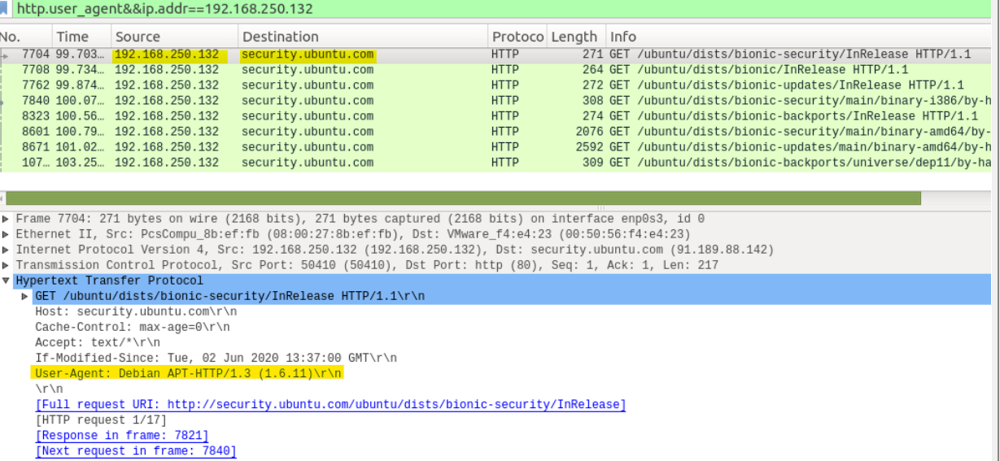
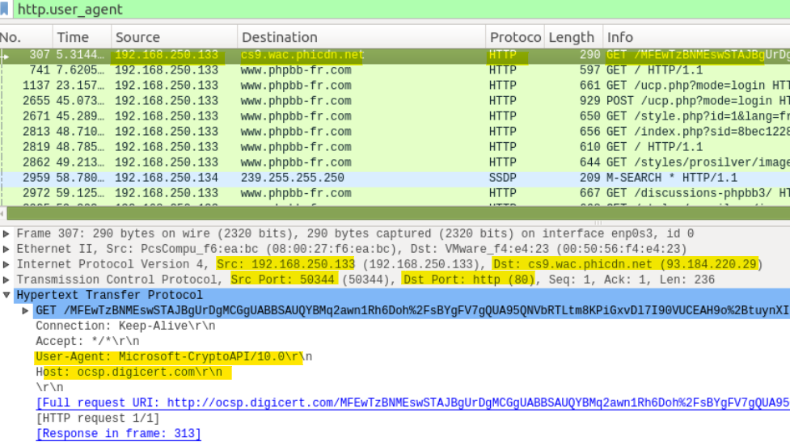
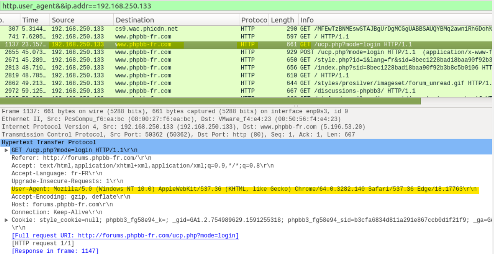
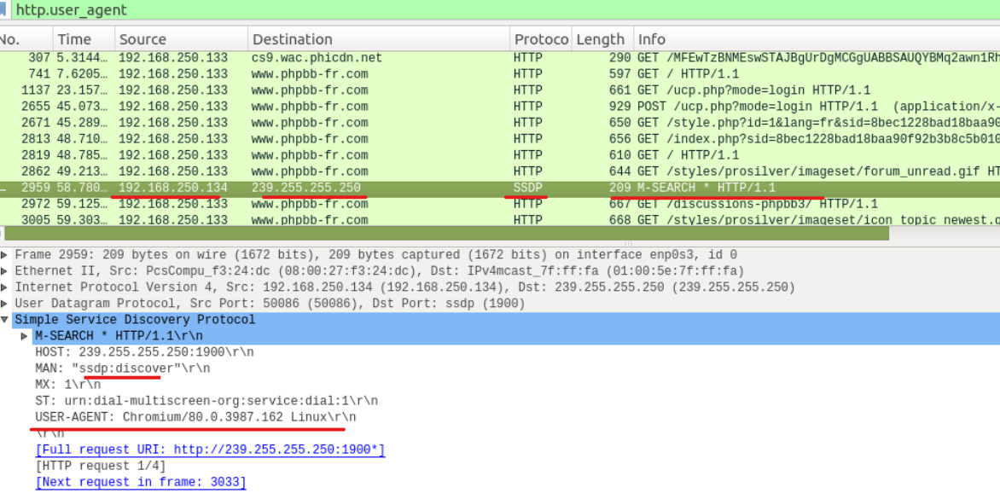
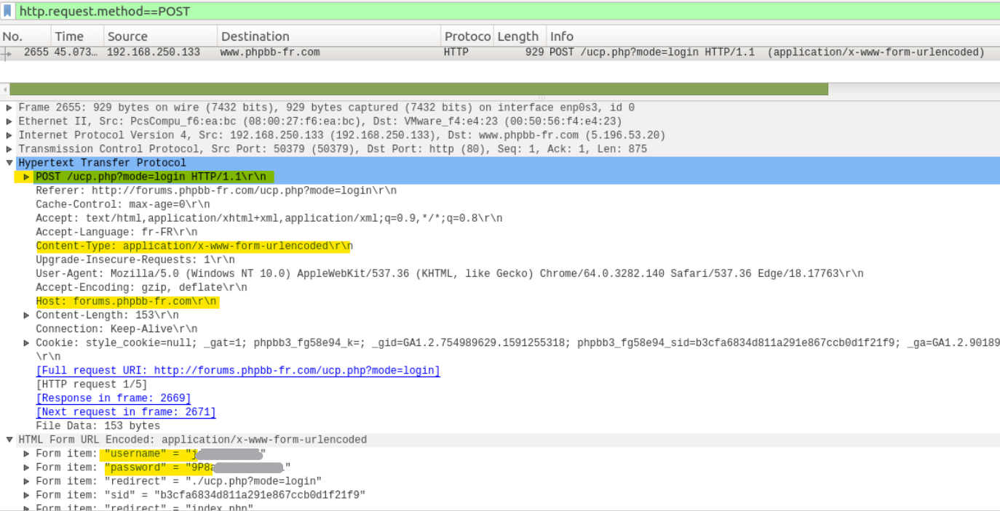
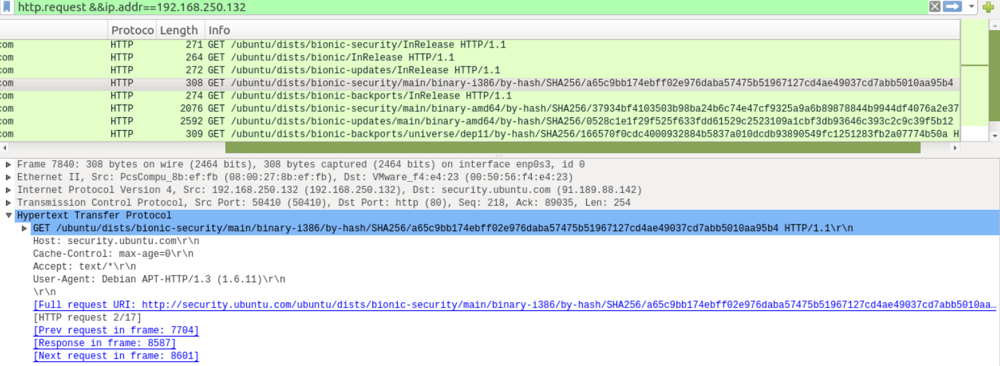
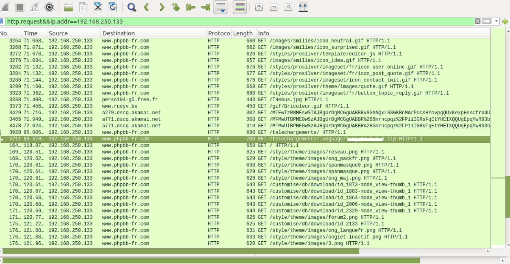
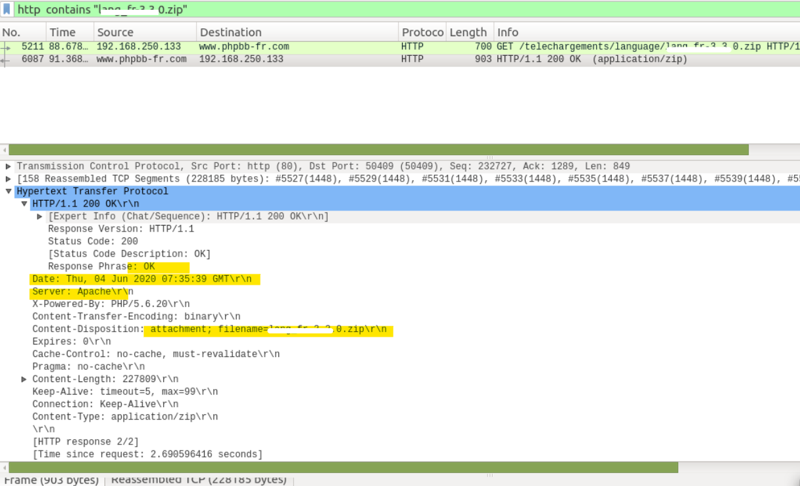
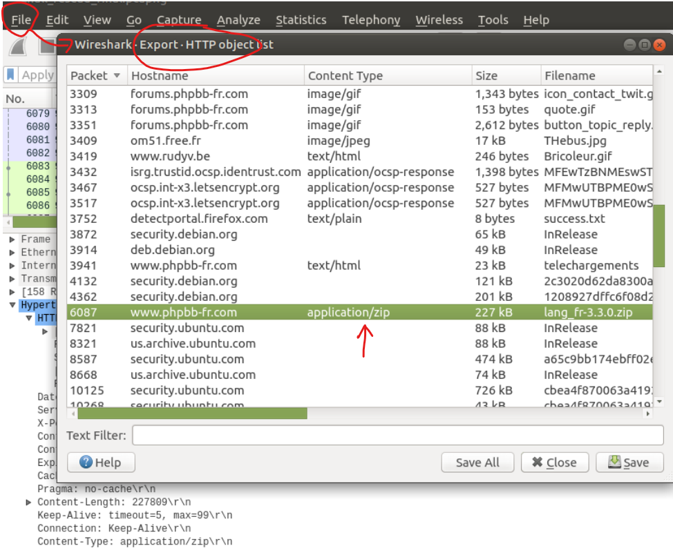

# Activité utilisateur 
## Objectif 
    Identifier les activités réalisées par les utilisateurs du réseau et distinguer les activités humaines de navigation web, les activités système automatiques, ainsi que les échanges réseau liés aux services internes.

    L’analyse vise également à reconstituer certaines actions utilisateur observées dans le trafic HTTP non chiffré.

## Identification des navigateurs et des types d’activité
### La méthode 
L'identification des activités HTTP a été réalisée à partir des en-têtes : **User-Agent**. \
Les filtres suivants ont été utilisés dans Wireshark  : **http.user-agent**.\
Ou en ligne de commande : **string dump.pcapng | grep -i "user-agent" |sort -u**

L'objectif est de distinguer les différents types de User-Agent observés :
- Navigateur web (activité utilisateur)
- Outil système ou API
- Mécanisme de découverte réseau ou trafic automatique.

### Résultats

🔹 ***Les machines 192.168.250.132 & 192.168.250.136***

    
    User-Agent : Debian APT-HTTP/1.3
    
Le User-Agent "Debian APT-HTTP/1.3" correspond au gestionnaire de paquets APT utilisé par les systèmes Linux de type Debian/Ubuntu.

Ce type de trafic indique des opérations de mise à jour ou d’installation de paquets logiciels.

    → Il ne s’agit pas d’une activité de navigation utilisateur mais d'une activité système.

    → Activité cohérente avec un système Linux Debian/Ubuntu

🔹 ***La machine 192.168.250.133***
#### (a) Echange avec cs9.wac.phicdn.net  

    User-Agent : Microsoft-CryptoAPI/10.0 

Ce User-Agent correspond aux mécanismes Windows de gestion des certificats  et des opérations cryptographiques (HTTPS, signatures). 

Cette activité ne correspond pas à une navigation utilisateur. Mais il s'agit d'une activité système normale.

#### (b) Comminication avec  www.phpbb-fr.com

  
    User-Agent: Mozilla/5.0 (Windows NT 10.0) AppleWebKit/537.36 (KHTML, like Gecko) Chrome/64.0.3282.140 Safari/537.36 Edge/18.17763

- Mozilla/5.0 (Windows NT 10.0) : Héritage historique, utilisé pour compatibilité;

- AppleWebKit/537.36 (KHTML, like Gecko) : Moteur de rendu web (layout engine). Il est utilisé par Chrome, Safari et Edge (ancienne version);

- Chrome/64.0.3282.140 : Indique une compatibilité avec les standards Chromium;

- Safari/537.36 : Signature héritée du moteur WebKit ; ne signifie pas que le navigateur Safari est utilisé;

- Edge/18.17763 : Identifie le navigateur réellement utilisé : Microsoft Edge 18.

    Le User-Agent observé contient plusieurs identifiants (Chrome, Safari, Edge) qui correspondent à des mécanismes de compatibilité entre navigateurs.

    Le navigateur réellement utilisé est Microsoft Edge 18.

    Ces éléments sont standards dans les User-Agent modernes et ne signifient pas l’utilisation de plusieurs navigateurs.

    → La machine 192.168.250.133 correspond à une machine utilisateur Windows utilisant Microsoft Edge.

🔹 ***La machine 192.168.250.134***

#### Echange avec 239.255.255.250  

Un User-Agent de type "Chromium/80" a été observé dans des communications avec l’adresse multicast 239.255.255.250.

Cette adresse est associée au protocole SSDP (Simple Service Discovery Protocol), utilisé pour la découverte de services sur le réseau local, la détection automatique d’équipements,
ou certaines fonctionnalités multimédias locales..

Ce trafic ne correspond pas à une activité de navigation web.

    → Aucune activité utilisateur explicite n’a été identifiée sur cette machine.

🔹 ***Synthèse des activités observées***

    | IP   | Type d’activité        |
    | ---- | ---------------------- |
    | .133 | Navigation utilisateur (Microsoft Edge)     |
    | .132 | Activité système Linux (APT)    |
    | .136 | Activité système Linux (dépôts logiciels) |
    | .134 | découverte réseau/trafic SSDP      |

## Analyse des authentifications HTTP
### Objectif

Identifier d’éventuelles transmissions d’identifiants en clair dans les communications HTTP.

### Méthode
L’analyse a été réalisée en filtrant les requêtes HTTP de type POST : 
**http.request.method == "POST"**

Les requêtes HTTP POST ont ensuite été inspectées afin d’identifier des paramètres d’authentification.

### Résultats

Une requête POST a été identifiée depuis la machine 192.168.250.133 vers le site www.phpbb-fr.com.

    L’analyse du contenu de la requête révèle la transmission de paramètres d’authentification : username & password

    Ces informations apparaissent en clair dans le corps de la requête HTTP.

### Interprétation

La machine 192.168.250.133 a effectué une tentative d’authentification sur le site www.phpbb-fr.com.

La transmission des identifiants en HTTP non chiffré constitue une faiblesse de sécurité importante ; Toute personne capable d’intercepter le trafic réseau pourrait récupérer les identifiants, les mots de passe ou d'autres données sensibles.

## Analyse de la navigation utilisateur

### Objectif

Reconstituer les actions réalisées par l’utilisateur à travers les requêtes HTTP observées dans la capture réseau.

### Méthode 
Les requêtes HTTP ont été filtrées à l’aide du filtre : : **http.reqest** 

La recherche a ensuite été affinée pour la machine utilisateur : par exemple **http.request && ip.addr==192.168.250.133**

### Résultats
#### 🔹 Navigation utilisateur IP 192.168.250.132

#### 🔹 Navigation utilisateur IP 192.168.250.133

L’analyse des requêtes HTTP met en évidence les actions suivantes :

- Chargement de ressources web (images, éléments de style) :\
  /images/smilies/*.gif\
  /styles/prosilver/imageset/fr/*.gif\
  Ces requêtes correspondent au chargement d’images, d’éléments graphiques et de ressources d’interface du site web.

- Accès à la section de téléchargement :
  /customise/db/download/

- Téléchargement d’un fichier compressé :
  /telechargements/language/lang_fr-3.3.0.zip

- Une réponse HTTP : 200 OK, confirme le téléchargement réussi du fichier.

L’analyse des en-têtes HTTP indique :
- Content-Type : application/zip
- Nom du fichier : xxxx.zip

Le fichier a été extrait via la fonctionnalité **Export Objects → HTTP** de Wireshark.

Le fichier xxxx.zip a ainsi pu être extrait pour une analyse complémentaire.

### Interprétation

La navigation observée correspond à une activité utilisateur classique sur un forum phpBB :

- consultation de pages web,
- chargement de ressources graphiques,
- navigation dans une section de téléchargement,
- récupération d’un fichier ZIP.

Le téléchargement du fichier xxx.zip constitue un élément important de l’investigation, car il permet de reconstituer l’activité utilisateur, d’identifier les fichiers récupérés et d’effectuer des analyses complémentaires sur le contenu téléchargé.

### Conclusion

L’analyse des activités utilisateur a permis :

-> d’identifier la principale machine utilisateur du réseau (192.168.250.133),
-> de distinguer les activités humaines des activités système,
-> de mettre en évidence une authentification HTTP non chiffrée,
-> ainsi qu’un téléchargement de fichier réalisé depuis un site web externe.

Les échanges HTTP non chiffrés fournissent des informations précieuses dans le cadre d’une investigation forensic, notamment pour :
- la reconstruction de la navigation,
- l’identification des actions utilisateur,
- et l’analyse des fichiers transférés.
