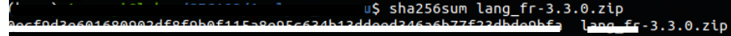

# Analyse du fichier téléchargé 

## Objectif

Extraire, identifier et analyser le fichier téléchargé par l’utilisateur afin de :

- vérifier son intégrité,
- comprendre sa nature,
- détecter d’éventuels indicateurs de compromission,
- et déterminer si le téléchargement correspond à une activité légitime.

## Extraction du fichier depuis le trafic réseau
### Méthode
Une réponse HTTP avec le code 200 OK a été identifiée dans le trafic réseau, confirmant le téléchargement réussi d'un fichier.

Le fichier a ensuite été extrait à l'aide de Wireshark via la fonctionnalité **Export Objects → HTTP**.

Cettefonctionnalité permet de récupérer les fichiers transférés en clair afin de les analyser localement (calcul de hash, inspection du contenu).

### Résultats

Le fichier téléchargé : xxx.zip a été extrait avec succès depuis la capture réseau.

L’analyse des en-têtes HTTP confirme le téléchargement du fichier, son type MIME ainsi que son nom d'origine.

## Calcul et exploitation du hash

### Objectif

Calculer l’empreinte cryptographique du fichier afin :

- de garantir son intégrité,
- de disposer d’un identifiant unique,
- et de faciliter d’éventuelles recherches dans des bases de données d’analyse de malware ou d’IOC.

### Méthode 

Le hash SHA256 du fichier a été calculé à l’aide des commandes suivantes :

    Sur Linux : sha256sum xxxx.zip
    Sur Windows (PowerShell) : Get-FileHash xxx.zip -Algorithm SHA256

### Résultats
Le hash SHA256 du fichier "xxxx.zip" a été calculé avec succès.

Le hash permet :\
- de vérifier que le fichier n’a pas été altéré lors de son extraction
- d’identifier précisément le fichier dans des bases de données externes
- de constituer une preuve numérique fiable dans le cadre de l’analyse forensic

### Interprétation

Le calcul du hash constitue une étape essentielle dans une investigation numérique.

L’empreinte SHA256 garantit l’intégrité du fichier analysé et permet d’assurer la traçabilité des éléments de preuve.

## Décompression et analyse du contenu du fichier téléchargé

### Objectif

Analyser le contenu de l’archive téléchargée afin de détecter :

- d’éventuels fichiers malveillants,
- du code suspect,
- ou des indicateurs de compromission.

### Méthode

Le fichier ZIP a été extrait et analysé à l’aide d’un outil de décompression (7-Zip) :
    - Sous Linux : unzip xxxx.zip  (ou unzip -l xxxx.zip : pour afficher le contenu sans extraction)
    - Sous Windows : clic droit -> ouvrir avec 7-Zip

### Résultats

L’archive contient une structure de fichiers cohérente avec un pack de langue phpBB :

    - dossiers de type "language/fr"
    - fichiers PHP contenant des chaînes de traduction
    - fichiers texte associés

    Aucun fichier exécutable ou suspect n’a été identifié.

    Le contenu des fichiers analysés ne présente pas de code obfusqué ou malveillant (eval(), base64_decode() ou code très long et illisible).

### Interprétation

Le fichier téléchargé correspond à un paquet de langue français pour phpBB.

Son contenu est cohérent avec une utilisation légitime et ne présente pas d’indicateurs de compromission (fichiers suspects .exe, .bat, .ps1 ou fichieer cachés).

    Le téléchargement observé s’inscrit donc dans un usage normal du site web.

## Conclusion

L’analyse du fichier téléchargé a permis :

- d’extraire le contenu transféré en HTTP,
- de vérifier son intégrité à l’aide d’un hash SHA256,
- d’inspecter le contenu de l’archive,
- et de confirmer l’absence d’éléments malveillants visibles.

Le fichier analysé correspond à un composant légitime de phpBB et ne présente, à ce stade, aucun comportement suspect.
