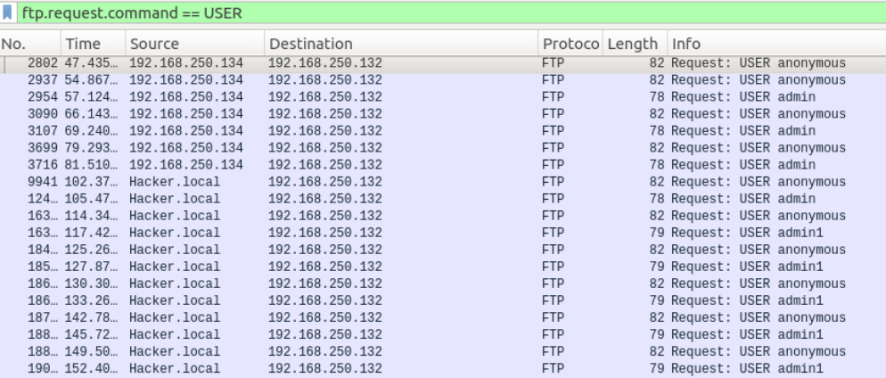
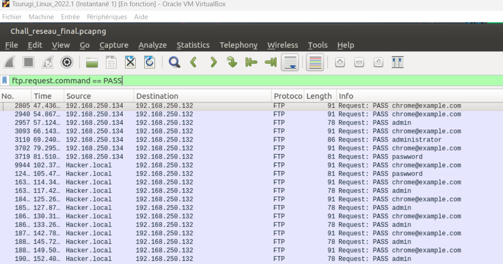
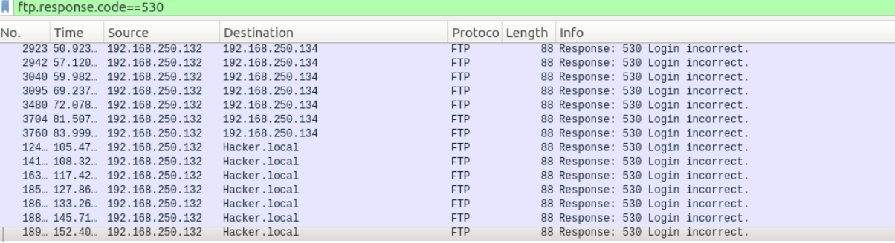
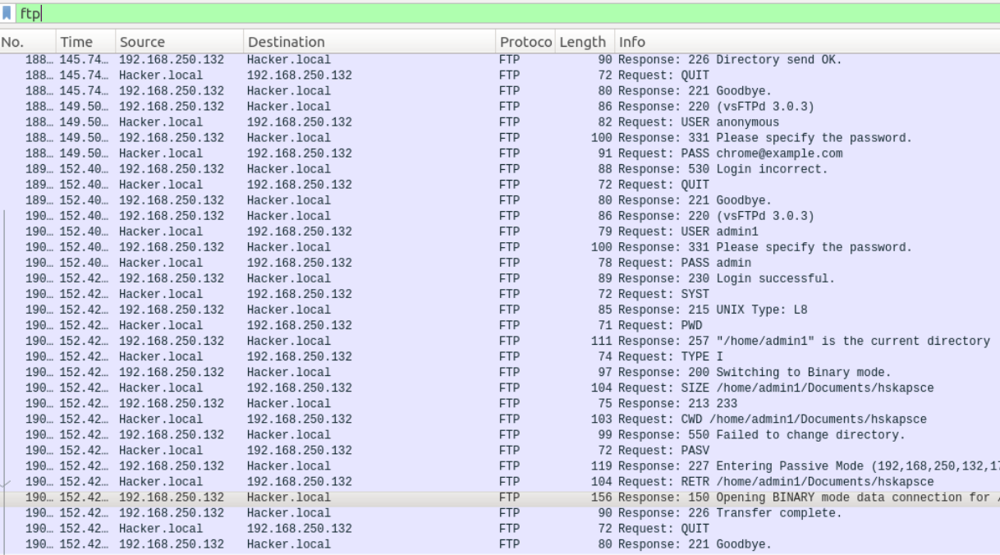
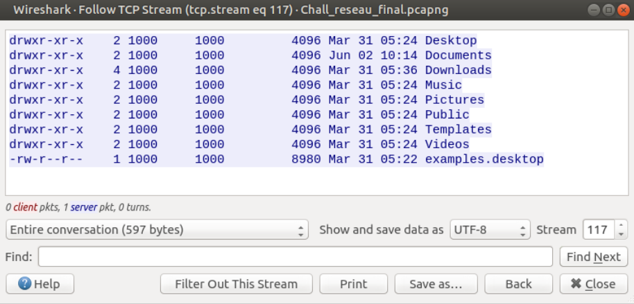

# Détection d’une tentative de brute force
## Objectif 
Identifier et caractériser une tentative de brute force FTP ainsi que ses conséquences.

## Méthode
Les requêtes FTP de types USER et PASS ont été analysées afin d’identifier des tentatives d’authentification répétées.
Dans Wireshark :
Rechercher sur USER : ftp.request.command==USER
Rechercher sur PASS : ftp.request.command==PASS

## Résultats
Le protocole FTP étant en clair, les identifiants sont directement observables dans le trafic.

Un nombre important de tentatives de connexion a été observé, caractérisé par :

- des variations d’identifiants (anonymous, admin, admin1)
- des variations de mots de passe (admin, password, chrome@example.com)
- des réponses serveur indiquant des échecs répétés (530 Login incorrect)

### Multiples tentatives USER

    
        On trouve une rotation d’identifiants (username enumeration) :
            USER anonymous
            USER admin
            USER admin1

### Multiples mots de passe

    
        On observe une attaque par dictionnaire :

        PASS chrome@example.com
        PASS admin
        PASS password

### Réponse serveur : échecs répétés

### Succès final: authentification réussie après phase de brute force

        USER admin1
        PASS admin
        → 230 Login successful

Ces tentatives proviennent notamment des machines :
- 192.168.250.134
- 192.168.250.136 (Hacker.local)

La cible de l’attaque est :
- 192.168.250.132 (serveur FTP)

Une authentification réussie est ensuite observée :
- USER : admin1
- PASS : admin

Suite à cette compromission, l’attaquant accède au répertoire :
/home/admin1/Documents/ et télécharge le fichier :
hskapsce

### Interprétation

    1- La fréquence élevée des tentatives confirme l’utilisation d’un outil automatisé.

    2- Les éléments observés sont caractéristiques donc d’une attaque par brute force FTP réussie, suivie d’une exfiltration de fichier.

# Analyse de contenu de fichier hskapsce

## Méthode :
Le fichier transféré a été identifié via le filtre "ftp-data" dans Wireshark.

Le flux TCP associé a été reconstitué à l’aide de la fonctionnalité "Follow TCP Stream", en mode "UTF-8" afin d’obtenir le contenu complet du fichier hskapsce (Analyze > follow > TCP stream).  

Le calcule de hash du fichier se fait avec :
md5sum hskapsce
sha256sum hskapsce

## Résultats

Le fichier "hskapsce" a été récupéré avec succès, confirmant l’exfiltration de données après compromission du serveur FTP.

Le contenu correspond à un listing de répertoire Linux, similaire à la sortie de la commande "ls -l".

On y retrouve notamment les répertoires :
- Desktop
- Documents
- Downloads
- Music
- Pictures
- Videos

ainsi qu’un fichier :
- examples.desktop

### Interprétation

Le fichier ne contient pas de données sensibles, mais des informations sur la structure du système de fichiers de l’utilisateur.

Cela indique que l’attaquant a effectué une phase de reconnaissance après compromission du compte FTP. Autrement dit, l’exfiltration du fichier correspond à une collecte d’informations système, et non à un vol direct de données critiques.
